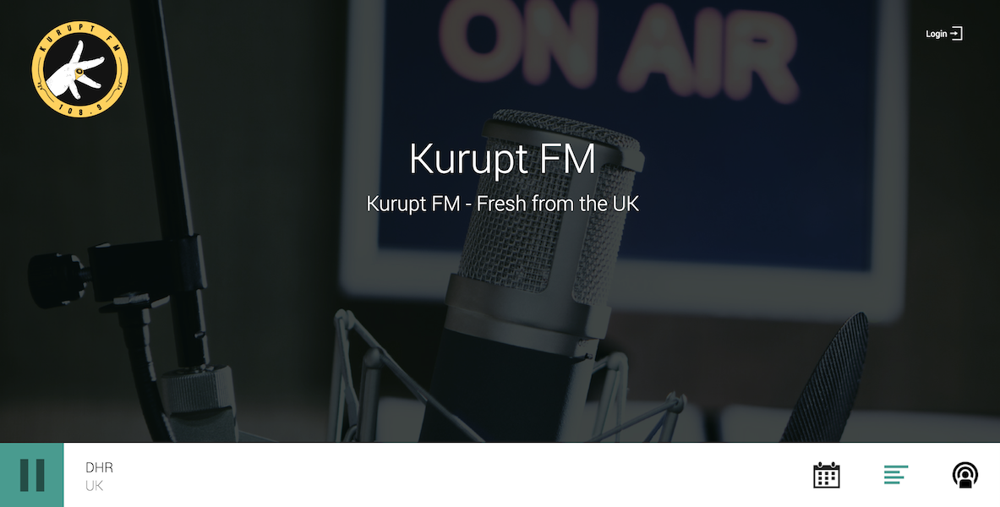

# "Libretime" Multi-container Docker Setup.

This is a multi-container Docker build of the Libretime Radio Broadcast Software _(Libretime is a direct fork of Airtime for those who are wondering, hence the similarities)_.

It's an aim to run the environment ready for production, with common media directories, database files etc mapped into the container(s) so data is persisted between rebuilds of the application.

It's originally based off my [`docker-multicontainer-airtime`](https://github.com/ned-kelly/docker-multicontainer-airtime) setup, and has been modified to suit the newer libretime accordingly.

---------------------------

**Current Supported Libretime Version**: `libretime-3.0.0-alpha.4`





## Overview:

The project consists of three main containers/components:

 - `libretime-core` - This is the main Libretime container, running the latest stable build distributed by Sourcefabric (as of September 2018) - Based on Ubuntu Trusty.
 - `libretime-rabbitmq` - A seperated RabbitMQ container based on Alpine Linux.
 - `libretime-postgres` - The database engine behind Libretime - It's also an Alpine Linux build in an attempt to be as 'lean and mean' as possible when it comes to system resources...

## Configuration:

You will want to edit the `docker-compose.yml` file and change some of the mappings to suit your needs.
If you're new to docker you should probably configure:

 - Edit: `/localmusic:/external-media` - Change this to the directory on your Linux server where your media resides.

 - Configure the environment variables in the `libretime-core` block if you don't want to run with the default configuration - Note it's safe to just leave the default configuration/passwords etc as services (Postgres, RabbitMQ, etc) are only accessible from within the containers as they are in a 'bridged' docker network.

 - You must configure `icecast.xml` to suit your needs - **(Don't leave the passwords as the default if you're exposing this to the internet)**.

## Standing up:

It's pretty straightforward, just clone down the sources and stand up the container like so:

```bash
# Clone down sources
git clone https://github.com/ned-kelly/docker-multicontainer-libretime.git

### MAKE YOUR CONFIGURATION CHANGES IF REQUIRED ###
vi docker-multicontainer-libretime/docker-compose.yml
vi docker-multicontainer-libretime/config/icecast.xml

# Then, create the shared docker network
docker network create libretime

# Stand up the container
docker-compose up -d --build

```
**NOTE**:
When running for the first time, the libretime-core container will run some 'boostrap' scripts. This will take 15-30 seconds (after standing up the containers) BEFORE you will be able to fully access libretime.

You can monitor the progress of the bootstrap process by running: `docker logs -f libretime-core`.

Once the containers have been stood up you should be able to access the project directly in your browser...

## Accessing:

Just go to http://server-ip:8882/ (change port 8882 to whatever you mapped in your docker-compose file if you changed this)...

 - Default Username: `admin`
 - Default Password: `admin`

If you need to check the status of any services you may also do so by going to:

 - http://server-ip:8882/?config

Have fun!

**BE SURE TO WAIT 15-30 SECONDS OR SO FOR THE CONTAINERS TO BOOTSTRAP BEFORE TRYING TO ACCESS FOR THE FIRST TIME**

## Things to note & hack fixes:

 - There seems to be a bug in the current build of Libretime where if you run Postgres on another host the web/ui fails to log in (without any logs/errors showing anywhere)... After much pain trying to get this running "properly", the quick and simple fix has been to use a TCP proxy, that just proxies the PostgreSQL port:5432 to the actual dedicated postgres container.

 - Icecast can't really run in it's own dedicated container because Libretime currently writes its config file - This could be fixed my mapping the config files from one container into the other, anyone want to submit a PR ;)

 - By default - using "localhost" as the server name variable (in airtime.conf), iFrames obviously won't work - For now we need to use a reverse proxy to replace the "localhost" iframes to be relative.. See [Feature Request 515](https://github.com/LibreTime/libretime/issues/515).
 
## Deploying on the internet?

You will need to setup port forwarding for:

 - TCP:8000 (Icecast server)
 - Perhaps to your web interface port if you want this public...
 - TCP:8001 & TCP:8002 (Remote access for Master & Source inputs - **NB: This allows open access to Libretime, use with caution or via a VPN.**

You might want to use something like [This Caddy Docker Container](https://github.com/abiosoft/caddy-docker) to proxy pass to Apache with an automatic signed SSL certificate thanks to Lets Encrypt... 
