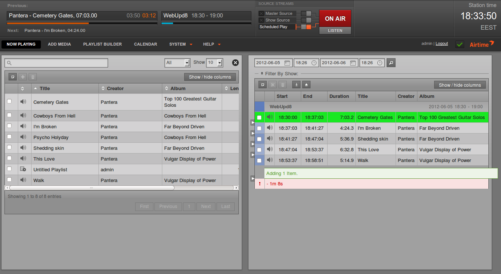

# "Libretime" Multi-container Docker Setup.

This is a multi-container Docker build of the Libretime Radio Broadcast Software (Libretime is a direct fork of Airtime for those who are wondering, hence the similarities).

It's an aim to run the environment ready for production, with common media directories, database files etc mapped into the container(s) so data is persisted between rebuilds of the application.

It's originally based off my [`docker-multicontainer-airtime`](https://github.com/ned-kelly/docker-multicontainer-airtime) setup, and has been modified to suit the newer libretime accordingly.

---------------------------




## Overview:

The project consists of three main containers/components:

 - `libretime-core` - This is the main Libretime container, running the latest stable build distributed by Sourcefabric (as of September 2018) - Based on Ubuntu Trusty.
 - `libretime-rabbitmq` - A seperated RabbitMQ container based on Alpine Linux.
 - `libretime-postgres` - The database engine behind Libretime - It's also an Alpine Linux build in an attempt to be as 'lean and mean' as possible when it comes to system resources...

## Configuration:

You will want to edit the `docker-compose.yml` file and change some of the mappings to suit your needs.
If you're new to docker you should probably just change the `/localmusic:/external-media` line to the directory on your Linux server where your media resides (Just replace `/localmusic` with the path to your media).

You will also want to configure `icecast.xml` to suit your needs - (Don't leave the passwords as the default if you're exposing this to the internet).

## Standing up:

It's pretty straightforward, just clone down the sources and stand up the container like so:

```bash
# Clone down sources
git clone https://github.com/ned-kelly/docker-multicontainer-libretime.git

# Create shared docker network
docker network create libretime

# Stand up the container
docker-compose up -d --build

```
**NOTE**:
When running for the first time, the libretime-core container will run some 'boostrap' scripts. This will take 30-60 seconds (after standing up the containers) BEFORE you will be able to fully access libretime.

You can monitor the progress of the bootstrap process by running: `docker logs -f libretime-core`.

Once the containers have been stood up you should be able to access the project directly in your browser...

## Accessing:

Just go to http://server-ip:8882/ (remove port 8882 if you mapped 80:80 in your docker-compose file)...

 - Default Username: `admin`
 - Default Password: `admin`

If you need to check the status of any services you may also do so by going to:

 - http://server-ip:8882/?config

Have fun!

**WAIT 30 SECONDS OR SO FOR THE CONTAINER TO BOOTSTRAP BEFORE TRYING TO ACCESS THE CONTAINER FOR THE FIRST TIME!**

## Things to note / hack fixes:

 - There seems to be a bug in the current build of Libretime where if you run Postgres on another host the web/ui fails to log in (without any logs/errors showing anywhere)... After much pain trying to get this running "properly", the quick and simple fix has been to use a TCP proxy, that just proxies the PostgreSQL port:5432 to the actual dedicated postgres container.

 - Icecast can't really run in it's own dedicated container because Libretime currently writes its config file - This could be fixed my mapping the config files from one container into the other, but how far do we want to go here... For now, there's going to be no harm running it in the main `libretime-core` container as it uses minimal resources anyway.


## Deploying on the internet?

You will need to setup port forwarding for TCP:8000 (Icecast server) and perhaps to your web interface...

You might want to use something like [Caddy](https://github.com/abiosoft/caddy-docker) to proxy pass to Apache with an automatic signed SSL certificate thanks to Lets Encrypt... 
